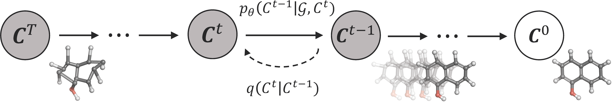
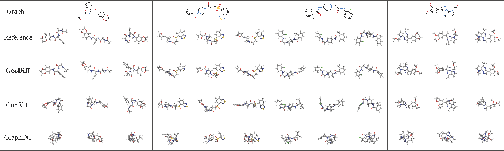

# GeoDiff: a Geometric Diffusion Model for Molecular Conformation Generation

[](https://github.com/MinkaiXu/GeoDiff/blob/main/LICENSE)

[[OpenReview](https://openreview.net/forum?id=PzcvxEMzvQC)] [[arXiv](https://arxiv.org/abs/2203.02923)] [[Code](https://github.com/MinkaiXu/GeoDiff)]

The official implementation of GeoDiff: A Geometric Diffusion Model for Molecular Conformation Generation (ICLR 2022 **Oral Presentation [54/3391]**).



## Environments

### Install via Conda (Recommended)

```bash
# Clone the environment
conda env create -f env.yml
# Activate the environment
conda activate geodiff
# Install PyG
conda install pytorch-geometric=1.7.2=py37_torch_1.8.0_cu102 -c rusty1s -c conda-forge
```

## Dataset

### Offical Dataset
The offical raw GEOM dataset is avaiable [[here]](https://dataverse.harvard.edu/dataset.xhtml?persistentId=doi:10.7910/DVN/JNGTDF).

### Preprocessed dataset
We provide the preprocessed datasets (GEOM) in this [[google drive folder]](https://drive.google.com/drive/folders/1b0kNBtck9VNrLRZxg6mckyVUpJA5rBHh?usp=sharing). After downleading the dataset, it should be put into the folder path as specified in the `dataset` variable of config files `./configs/*.yml`.

### Prepare your own GEOM dataset from scratch (optional)

You can also download origianl GEOM full dataset and prepare your own data split. A guide is available at previous work ConfGF's [[github page]](https://github.com/DeepGraphLearning/ConfGF#prepare-your-own-geom-dataset-from-scratch-optional).

## Training

All hyper-parameters and training details are provided in config files (`./configs/*.yml`), and free feel to tune these parameters.

You can train the model with the following commands:

```bash
# Default settings
python train.py ./config/qm9_default.yml
python train.py ./config/drugs_default.yml
# An ablation setting with fewer timesteps, as described in Appendix D.2.
python train.py ./config/drugs_1k_default.yml
```

The model checkpoints, configuration yaml file as well as training log will be saved into a directory specified by `--logdir` in `train.py`.

## Generation

We provide the checkpoints of two trained models, i.e., `qm9_default` and `drugs_default` in the [[google drive folder]](https://drive.google.com/drive/folders/1b0kNBtck9VNrLRZxg6mckyVUpJA5rBHh?usp=sharing). Note that, please put the checkpoints `*.pt` into paths like `${log}/${model}/checkpoints/`, and also put corresponding configuration file `*.yml` into the upper level directory `${log}/${model}/`.

You can generate conformations for entire or part of test sets by:

```bash
python test.py ${log}/${model}/checkpoints/${iter}.pt \
    --start_idx 800 --end_idx 1000
```
Here `start_idx` and `end_idx` indicate the range of the test set that we want to use. All hyper-parameters related to sampling can be set in `test.py` files. Specifically, for testing qm9 model, you could add the additional arg `--w_global 0.3`, which empirically shows slightly better results.

Conformations of some drug-like molecules generated by GeoDiff are provided below.

<p align="center">
   
</p>

## Evaluation

After generating conformations following the obove commands, the results of all benchmark tasks can be calculated based on the generated data.

### Task 1. Conformation Generation

The `COV` and `MAT` scores on the GEOM datasets can be calculated using the following commands:

```bash
python eval_covmat.py ${log}/${model}/${sample}/sample_all.pkl
```


### Task 2. Property Prediction

For the property prediction, we use a small split of qm9 different from the `Conformation Generation` task. This split is also provided in the [[google drive folder]](https://drive.google.com/drive/folders/1b0kNBtck9VNrLRZxg6mckyVUpJA5rBHh?usp=sharing). Generating conformations and evaluate `mean  absolute errors (MAR)` metric on this split can be done by the following commands:

```bash
python ${log}/${model}/checkpoints/${iter}.pt --num_confs 50 \
      --start_idx 0 --test_set data/GEOM/QM9/qm9_property.pkl
python eval_prop.py --generated ${log}/${model}/${sample}/sample_all.pkl
```

## Visualizing molecules with PyMol

Here we also provide a guideline for visualizing molecules with PyMol. The guideline is borrowed from previous work ConfGF's [[github page]](https://github.com/DeepGraphLearning/ConfGF#prepare-your-own-geom-dataset-from-scratch-optional).

### Start Setup

1. `pymol -R`
2. `Display - Background - White`
3. `Display - Color Space - CMYK`
4. `Display - Quality - Maximal Quality`
5. `Display Grid`
   1. by object:  use `set grid_slot, int, mol_name` to put the molecule into the corresponding slot
   2. by state: align all conformations in a single slot
   3. by object-state: align all conformations and put them in separate slots. (`grid_slot` dont work!)
6. `Setting - Line and Sticks - Ball and Stick on - Ball and Stick ratio: 1.5`
7. `Setting - Line and Sticks - Stick radius: 0.2 - Stick Hydrogen Scale: 1.0`

### Show Molecule

1. To show molecules

   1. `hide everything`
   2. `show sticks`

2. To align molecules: `align name1, name2`

3. Convert RDKit mol to Pymol

   ```python
   from rdkit.Chem import PyMol
   v= PyMol.MolViewer()
   rdmol = Chem.MolFromSmiles('C')
   v.ShowMol(rdmol, name='mol')
   v.SaveFile('mol.pkl')
   ```


## Citation
Please consider citing the our paper if you find it helpful. Thank you!
```
@inproceedings{
xu2022geodiff,
title={GeoDiff: A Geometric Diffusion Model for Molecular Conformation Generation},
author={Minkai Xu and Lantao Yu and Yang Song and Chence Shi and Stefano Ermon and Jian Tang},
booktitle={International Conference on Learning Representations},
year={2022},
url={https://openreview.net/forum?id=PzcvxEMzvQC}
}
```

## Acknowledgement

This repo is built upon the previous work ConfGF's [[codebase]](https://github.com/DeepGraphLearning/ConfGF#prepare-your-own-geom-dataset-from-scratch-optional). Thanks Chence and Shitong!

## Contact

If you have any question, please contact me at minkai.xu@umontreal.ca or xuminkai@mila.quebec.

## Known issues

1. The current codebase is not compatible with more recent torch-geometric versions.
2. The current processed dataset (with PyD data object) is not compatible with more recent torch-geometric versions.